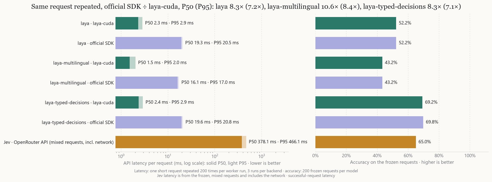

[English](README.md) | 简体中文

# laya-cuda

一个轻量的 [Laya](https://github.com/NandhaKishorM/laya) 推理库



同一请求重复 200 次测得的延迟：

| 模型 | 请求 | laya-cuda P50 / P95 | 官方 SDK P50 / P95 | 加速 P50 / P95 |
|---|---|---:|---:|---:|
| `laya` | 短，83 token | 2.3 / 2.9 ms | 19.3 / 20.5 ms | 8.3× / 7.2× |
| `laya` | 满上下文，512 token | 5.6 / 6.0 ms | 18.9 / 20.0 ms | 3.4× / 3.3× |
| `laya-multilingual` | 短，81 token | 1.5 / 2.0 ms | 16.1 / 17.0 ms | 10.6× / 8.4× |
| `laya-multilingual` | 满上下文，1,024 token | 4.9 / 5.4 ms | 15.8 / 17.0 ms | 3.2× / 3.1× |
| `laya-typed-decisions` | 短，83 token | 2.4 / 2.9 ms | 19.6 / 20.8 ms | 8.3× / 7.1× |
| `laya-typed-decisions` | 满上下文，1,024 token | 9.6 / 9.9 ms | 19.8 / 21.3 ms | 2.1× / 2.2× |

200 条冻结请求上的准确率（laya-cuda / SDK）：`laya` 52.25% / 52.25%，`laya-multilingual` 43.25% / 43.25%，`laya-typed-decisions` 69.25% / 69.75%。更大的远程模型 Jev 在 `laya` 这组请求上为 65.00%，延迟 378 / 466 ms，其中包含网络延迟。

- **测试环境：** RTX 4090，Windows 11。短请求是一条真实的 AG News 请求，带一个四选项问题；满上下文请求问同一个问题，文本是截断到模型上限的真实文本。每个请求在每个进程中运行 200 次，每个后端 3 个进程，交替先后顺序。
- **计时范围：** 完整的 `predict` 调用，包括分词、GPU 计算和解码。Jev 的时间还包含网络往返。
- **混合请求：** 在 200 条各不相同的冻结请求上（40–900 token，1–5 个问题，4–77 个选项，包含每种新形状的首次请求），`laya` 为 4.1 / 8.5 ms，SDK 为 20.1 / 22.1 ms，即 4.9× / 2.6×。不同大小的请求混在一起会抬高 P95，[长尾延迟报告（英文）](reports/latency/results.md)解释了原因。
- **SDK 精度：** 官方 SDK 以默认的 BF16 运行。在 2,000 个决策的固定评测集上，laya-cuda 比 BF16 更接近 FP32 精度的 SDK。
- **测试协议：** 见 [benchmarks/（英文）](benchmarks/README.md)；冻结输入的来源记录在[长尾延迟报告（英文）](reports/latency/results.md)里。

## 安装

```sh
pip install laya-cuda   # 核心安装：CuPy + CUDA 组件，不装 Torch
laya-cuda doctor laya   # 检查驱动、GPU 和 CUDA 组件，并计时一次预测
```

支持 Windows 或 Linux x86-64、Python 3.12–3.14，需要 NVIDIA 驱动，不需要安装 CUDA Toolkit。如果要改源码，用 [uv](https://docs.astral.sh/uv/)：

```sh
git clone https://github.com/Alexw1111/laya-cuda
cd laya-cuda
uv sync
uv run laya-cuda doctor laya
```

## 使用

```python
from laya_cuda import Engine

questions = {
    "team": {"type": "choice", "instructions": "Which team should handle this request?",
             "criteria": {"billing": "payments and refunds", "technical": "software errors"}},
    "urgent": {"type": "noul", "instructions": "Does this need urgent attention?"},
}
with Engine("laya") as model:
    print(model.predict("Please refund my duplicate payment.", questions)["answers"])
```

```sh
laya-cuda predict "Please refund my duplicate payment." -q questions.json
laya-cuda predict -i requests.jsonl -q questions.json -o results.jsonl
```

返回结构与 SDK 相同：概率、置信度、动作概率和 token 用量。`BatchEngine` 可以合并并发调用。`backend="official"` 会调用未经修改的官方 SDK 作对照，需要 `full` 或 `reference` 扩展。

## 更多

- **[使用指南（英文）](docs/guide.md)：** `Engine`、`BatchEngine`、模型注册表、平台与驱动细节、开发、架构。
- **[示例（英文）](examples/README.md)：** 决策工作流、Jev 客户端，以及 Snake Lab：一个每一步都由 Laya 预测决定的实时演示。
- **[基准测试（英文）](benchmarks/README.md)：** 对比测试、门槛和报告是如何工作的。
- **[FP32 参照验证（英文）](reports/fp32-reference/results.md)：** 数值、长输入和准确率门槛的完整记录。
- **[长尾延迟（英文）](reports/latency/results.md)：** P95 为什么是 P50 的两倍、如何修复，以及在未调优负载上的验证。
- **[添加模型（英文）](docs/extending.md)：** 适配器的做法。

整个库约 1,270 行 Python 和 CUDA 代码。CuPy 负责显存、stream 和 CUDA Graph；cuBLAS 负责矩阵乘法；其余部分由少量 NVRTC kernel 完成，其中包括一个融合的 Tensor Core 注意力 kernel。

## 致谢

- 首先感谢 [Laya](https://github.com/NandhaKishorM/laya) 项目和它的开发者。没有 Laya，就不会有这个项目。
- 感谢 [typed-decisions](https://huggingface.co/datasets/LocalLLaMA/typed-decisions)、[AG News](https://huggingface.co/datasets/fancyzhx/ag_news)、[DAIR Emotion](https://huggingface.co/datasets/dair-ai/emotion)、[Banking77](https://huggingface.co/datasets/mteb/banking77) 和 [MASSIVE](https://huggingface.co/datasets/mteb/amazon_massive_intent) 这些 benchmark。
- 感谢 [laya-mlx](https://github.com/mizorewww/laya-mlx)，给了我做这个项目的灵感。

## 许可证

源代码及派生的请求语义采用 Apache-2.0 许可；见 [LICENSE](LICENSE) 和 [laya_cuda/NOTICE](laya_cuda/NOTICE)。模型和数据集的许可证另行适用。
